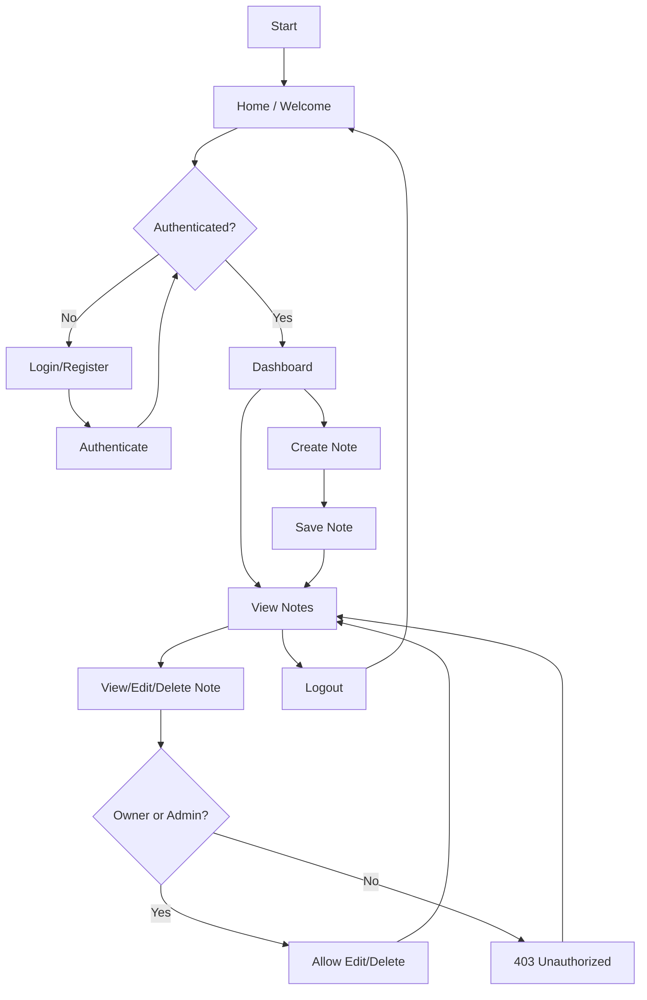
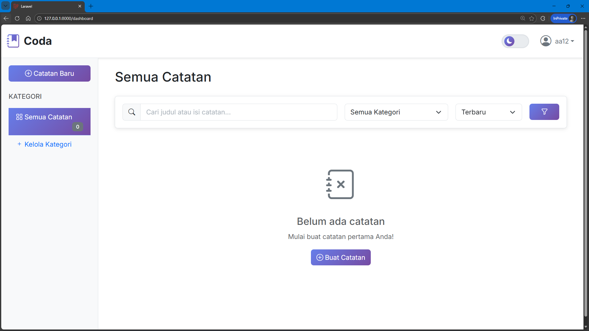
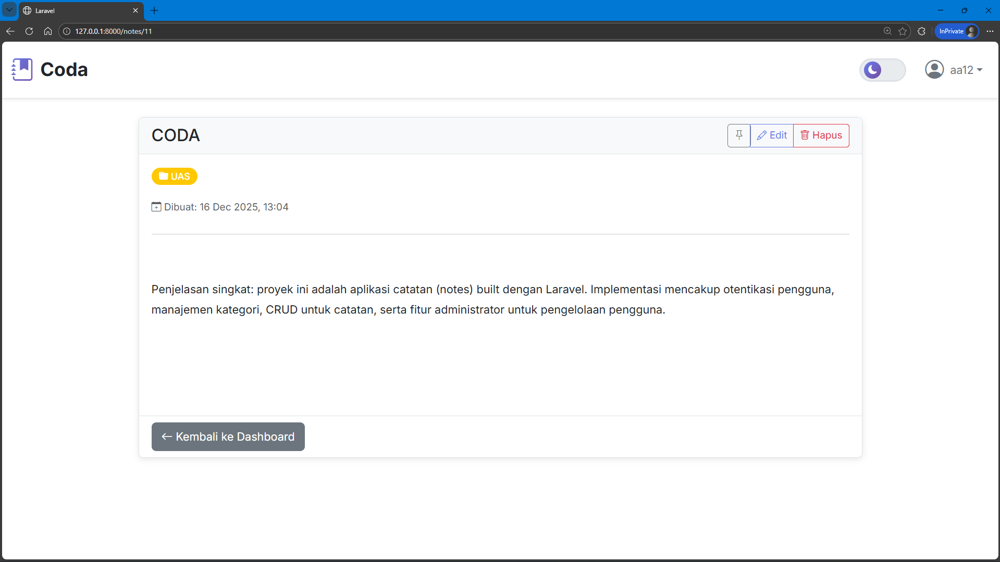
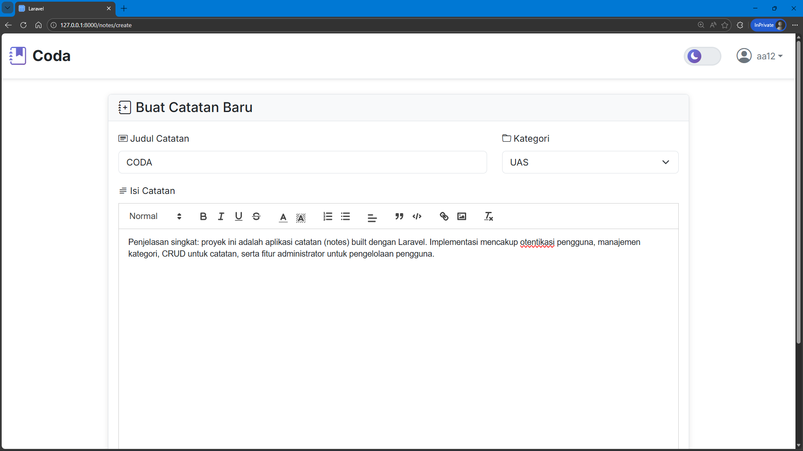

<p align="center"><a href="https://laravel.com" target="_blank"></a></p>

<p align="center">
<a href="https://github.com/laravel/framework/actions"></a>
<a href="https://packagist.org/packages/laravel/framework"></a>
<a href="https://packagist.org/packages/laravel/framework"></a>
<a href="https://packagist.org/packages/laravel/framework"></a>
</p>

## About Laravel

Laravel is a web application framework with expressive, elegant syntax. We believe development must be an enjoyable and creative experience to be truly fulfilling. Laravel takes the pain out of development by easing common tasks used in many web projects, such as:

- [Simple, fast routing engine](https://laravel.com/docs/routing).
- [Powerful dependency injection container](https://laravel.com/docs/container).
- Multiple back-ends for [session](https://laravel.com/docs/session) and [cache](https://laravel.com/docs/cache) storage.
- Expressive, intuitive [database ORM](https://laravel.com/docs/eloquent).
- Database agnostic [schema migrations](https://laravel.com/docs/migrations).
- [Robust background job processing](https://laravel.com/docs/queues).
- [Real-time event broadcasting](https://laravel.com/docs/broadcasting).

Laravel is accessible, powerful, and provides tools required for large, robust applications.

## Learning Laravel

Laravel has the most extensive and thorough [documentation](https://laravel.com/docs) and video tutorial library of all modern web application frameworks, making it a breeze to get started with the framework. You can also check out [Laravel Learn](https://laravel.com/learn), where you will be guided through building a modern Laravel application.

If you don't feel like reading, [Laracasts](https://laracasts.com) can help. Laracasts contains thousands of video tutorials on a range of topics including Laravel, modern PHP, unit testing, and JavaScript. Boost your skills by digging into our comprehensive video library.

## Laravel Sponsors

We would like to extend our thanks to the following sponsors for funding Laravel development. If you are interested in becoming a sponsor, please visit the [Laravel Partners program](https://partners.laravel.com).

### Premium Partners

- **[Vehikl](https://vehikl.com)**
- **[Tighten Co.](https://tighten.co)**
- **[Kirschbaum Development Group](https://kirschbaumdevelopment.com)**
- **[64 Robots](https://64robots.com)**
- **[Curotec](https://www.curotec.com/services/technologies/laravel)**
- **[DevSquad](https://devsquad.com/hire-laravel-developers)**
- **[Redberry](https://redberry.international/laravel-development)**
- **[Active Logic](https://activelogic.com)**

## Contributing

Thank you for considering contributing to the Laravel framework! The contribution guide can be found in the [Laravel documentation](https://laravel.com/docs/contributions).

## Code of Conduct

In order to ensure that the Laravel community is welcoming to all, please review and abide by the [Code of Conduct](https://laravel.com/docs/contributions#code-of-conduct).

## Security Vulnerabilities

If you discover a security vulnerability within Laravel, please send an e-mail to Taylor Otwell via [taylor@laravel.com](mailto:taylor@laravel.com). All security vulnerabilities will be promptly addressed.

## License

The Laravel framework is open-sourced software licensed under the [MIT license](https://opensource.org/licenses/MIT).

## Project: Coda

Penjelasan singkat: proyek ini adalah aplikasi catatan (notes) built dengan Laravel. Implementasi mencakup otentikasi pengguna, manajemen kategori, CRUD untuk catatan, serta fitur administrator untuk pengelolaan pengguna.

## Authors

- Azzam Tsabitul Jamil (K3523001)
- Fauzan Ahmad Ciptawan (K3523031)
- Muhammad Fahry Ali (K3523047)

## Penjelasan Kode (Ringkas)

Struktur penting dan peran:

- `app/Http/Controllers` — Kontroler utama untuk menangani request (NoteController, CategoryController, DashboardController, dll.).
- `app/Models` — Model Eloquent (`Note`, `category`, `User`) untuk berinteraksi dengan database.
- `resources/views` — Blade templates untuk tampilan frontend (halaman daftar catatan, buat/edit, dashboard, auth, dll.).
- `routes/web.php` — Rute web aplikasi (route grup auth, resource routes untuk notes & categories).
- `database/migrations` — Skema database; lihat migrasi `create_notes_table` dan `create_categories_table`.
- `tests/` — Contoh test (skeleton), bisa dikembangkan untuk unit/feature tests.

Fitur utama:

- Otentikasi (register/login/verify/password reset) — menggunakan scaffolding Laravel auth.
- CRUD catatan dengan kategori.
- Kebijakan akses pada `app/Policies` untuk memastikan hanya pemilik atau admin yang dapat mengedit/hapus.

Contract singkat (inputs/outputs):

- Input: HTTP requests (form data) dari pengguna terautentikasi.
- Output: HTML views (Blade) dan redirect/flash messages untuk hasil operasi.
- Error modes: validasi form, otorisasi (403), dan error server (500).

Edge cases utama:

- Pengguna tanpa otorisasi mencoba mengakses resource lain (ditangani oleh Policy/Authorize).
- Form kosong atau invalid (ditangani oleh Request validation di controller).
- Koneksi DB bermasalah (app akan menampilkan error environment/exception ketika debug off).

## Workflow (User Flow)

Langkah umum alur pengguna:

1. Pengguna membuka halaman utama -> diarahkan ke `HomeController` / `welcome`.
2. Mendaftar atau masuk (auth) -> setelah login diarahkan ke `DashboardController`.
3. Di dashboard, pengguna dapat melihat daftar catatan atau membuat catatan baru.
4. Membuat catatan: pilih kategori (atau buat baru), isi judul dan isi, submit -> server menyimpan dan redirect ke daftar catatan.
5. Mengedit / menghapus catatan: hanya pemilik (atau admin) dapat melakukan.

### Flowchart (Mermaid)

Jika viewer mendukung Mermaid, diagram ini menunjukkan alur dasar aplikasi:



Jika platform tidak merender Mermaid, berikut versi teks singkat:

- Home -> (Auth?) -> Login/Register -> Dashboard -> (View/Create/Edit/Delete Notes) -> Logout

## Hasil Tampilan (Screenshots & Keterangan)

Berikut adalah daftar tampilan penting dan file view terkait. Tambahkan screenshot ke folder `docs/screenshots/` dan gunakan nama yang disebutkan untuk referensi.

- Dashboard: `resources/views/dashboard.blade.php` — ringkasan dan daftar catatan.
- Daftar Catatan: `resources/views/notes/index.blade.php` — tabel/daftar note.
- Buat Catatan: `resources/views/notes/create.blade.php` — form untuk membuat note.
- Edit Catatan: `resources/views/notes/edit.blade.php` — form untuk edit.
- Tampil Catatan: `resources/views/notes/show.blade.php` — tampilan detail catatan.
- Manajemen Kategori: `resources/views/categories/index.blade.php`, `create.blade.php`, `edit.blade.php`.

Contoh placeholder (silakan ganti dengan screenshot nyata):





Jika Anda ingin menambahkan screenshot nyata, buat folder `docs/screenshots/` dan taruh file PNG dengan nama di atas.

## Cara Menjalankan Singkat (Local)

1. Salin `.env.example` ke `.env` dan atur konfigurasi DB.
2. Jalankan composer install dan npm install:

```bash
composer install
cp .env.example .env
php artisan key:generate
npm install
npm run dev
php artisan migrate --seed
php artisan serve
```

3. Kunjungi http://127.0.0.1:8000 dan daftar/login.

Catatan: untuk Windows PowerShell, gunakan `Copy-Item` jika `cp` tidak tersedia, atau lakukan langkah sesuai shell Anda.

## Notes & Next Steps

- Untuk dokumentasi lebih lengkap, pertimbangkan menambahkan screenshot nyata dan flowchart PNG ke folder `docs/`.
- Tambahkan unit/feature tests untuk memastikan fungsionalitas CRUD dan kebijakan akses.

---

_README diperbarui oleh tim pengembang untuk menyertakan author, workflow, flowchart, dan instruksi ringkas._
